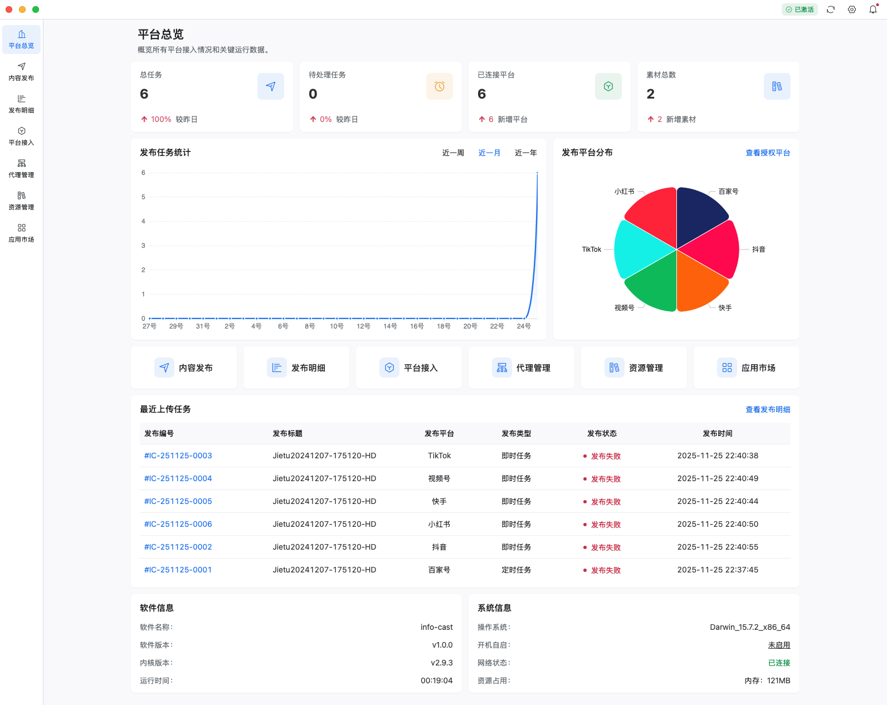
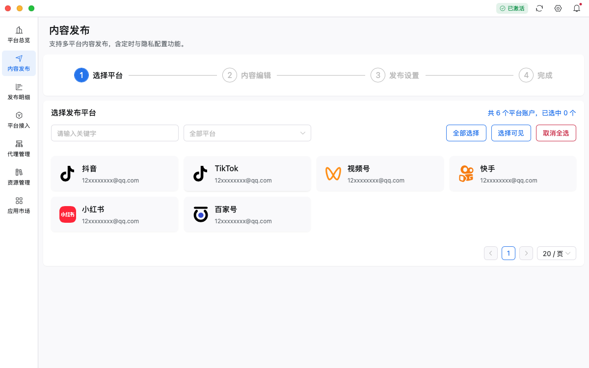
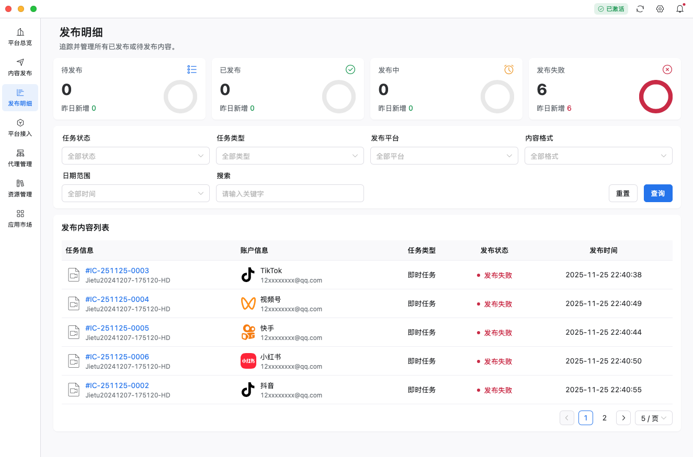
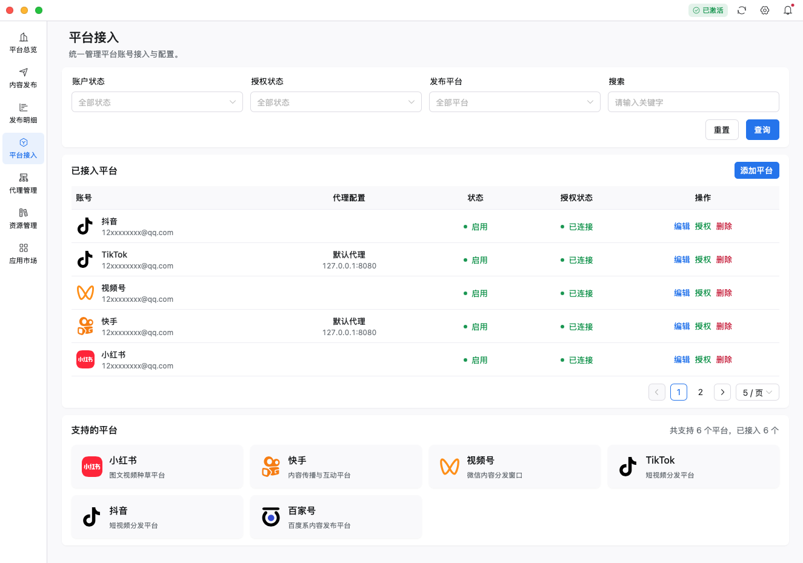
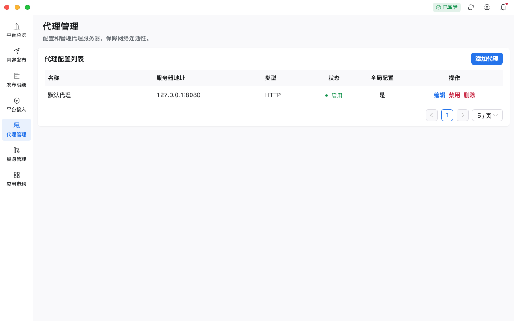
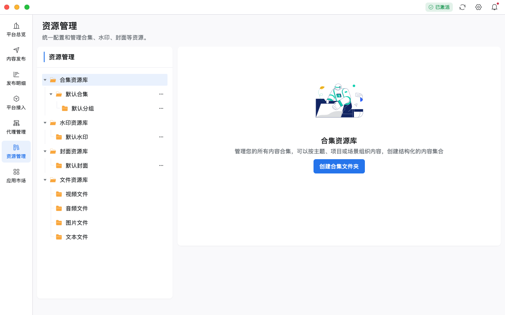
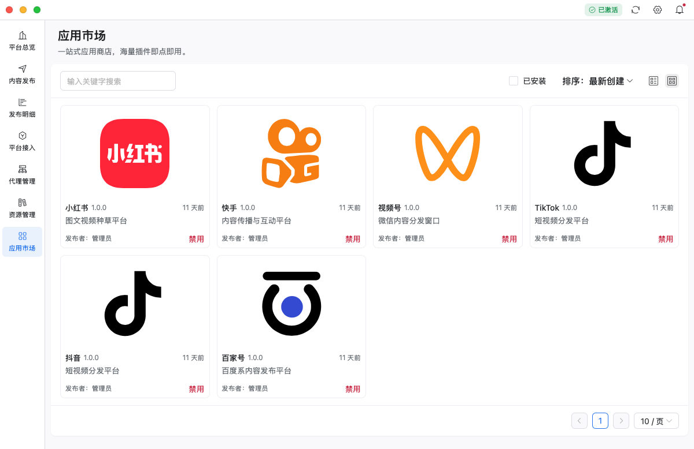
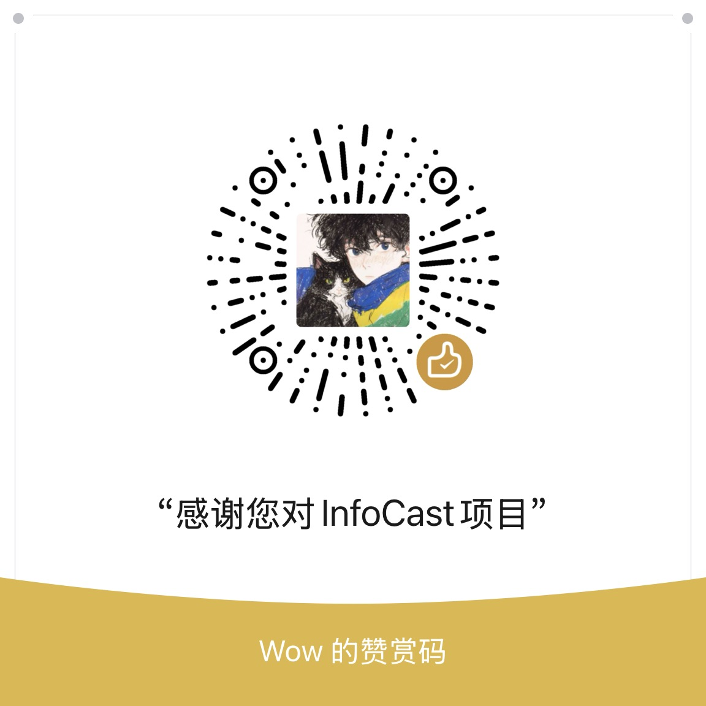
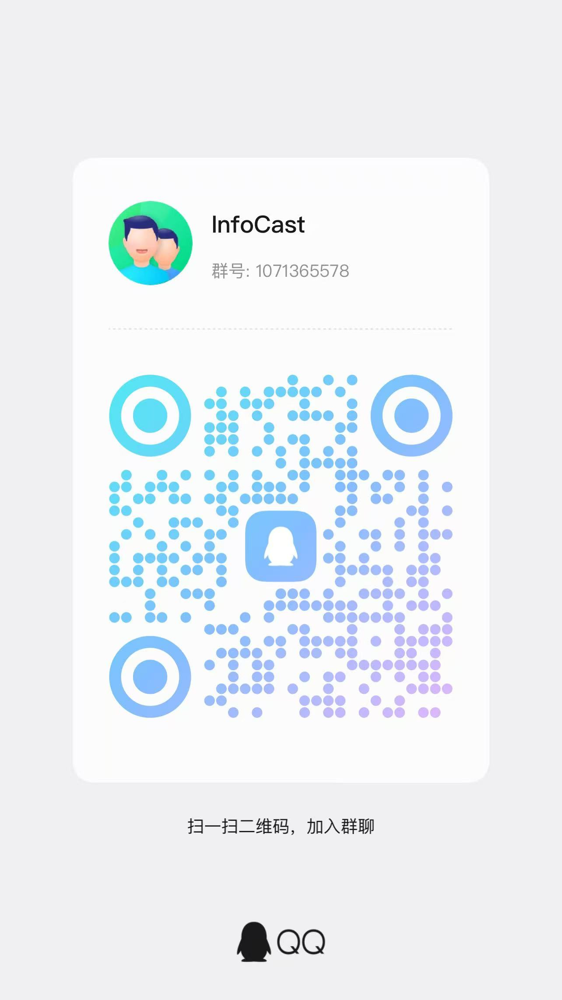

# 🛍 info-cast-app-store

**info-cast-app-store** 是 **[info-cast](https://github.com/opcooc/info-cast-updater)** 的开源插件市场仓库，基于 Playwright、NodeJs 实现自动化网页操作。  
作为 info-cast 的“平台能力中心”，它负责插件的发布、更新与版本管理。  
开发者可通过 info-cast-app-store 为 info-cast 提供新的平台接入能力或扩展现有功能。

---

## 📌 关于 InfoCast

**InfoCast** 是面向多平台内容创作者和企业用户的 **内容统一管理与分发客户端**。  
它帮助用户轻松实现内容创作、资源管理、账号接入、任务发布、数据统计分析及插件扩展的全流程管理。 

💡 **优势与应用场景**：  
- 多平台内容统一发布与管理  
- 支持视频、图片、音频及富文本内容  
- 灵活配置发布策略：即时发布 / 定时发布  
- 多账号、多平台统一管理，减少重复操作  
- 插件扩展能力强，可快速接入新平台或功能  

---

## 🔧 核心功能

| 功能 | 描述 | 图标 |
|------|------|------|
| 多平台内容管理与发布 | 灵活选择平台及账号；上传视频/图片/音频/富文本；支持即时发布 & 定时发布 | 🖥️ |
| 发布明细查看与统计 | 查看发布任务台账；支持即时/定时任务；可扩展数据分析 | 📊 |
| 平台接入（账户管理） | 通过插件接入不同平台；一个平台可绑定多个账号；统一管理授权与登录 | 🔌 |
| 代理管理 | 每个账号可独立配置代理；支持跨地区运营与多账号隔离 | 🌐 |
| 资源管理 | 上传并管理资源文件；支持资源库与合集文件夹 | 🗂️ |
| 插件/平台应用市场 | 下载 / 更新 / 管理插件；扩展平台能力；决定平台登录与授权方式 | 🛍️ |

---

## 🧩 平台能力支持矩阵（彩色徽章）

| 平台 | 视频上传 | 图片 | 富文本 | 音频 |
|------|-----------|-----------------|--------|------|
| 抖音（Douyin） |  |  |  |  |
| 快手（Kuaishou） |  |  |  |  |
| 视频号（Shipinhao） |  |  |  |  |
| TikTok |  |  |  |  |
| 小红书（Xiaohongshu） |  |  |  |  |
| 百家号（Baijiahao） |  |  |  |  |
| Bilibili |  |  |  |  | 
| 待支持平台 |  |  |  |  | 

---

## 💾 安装方式

**InfoCast 支持 Windows / macOS / Linux 三大平台，下载对应版本安装：**

| 平台 | 安装包 |
|------|--------|
| Windows 10, Windows 11 EXE | 📥 [下载](https://github.com/opcooc/info-cast-updater/releases/download/v1.0.0/info-cast_1.0.0_x64-setup.exe) |
| Windows 10, Windows 11 MSI  | 📥 [下载](https://github.com/opcooc/info-cast-updater/releases/download/v1.0.0/info-cast_1.0.0_x64_zh-CN.msi) |
| macOS 10.5+ x64    | 📥 [下载](https://github.com/opcooc/info-cast-updater/releases/download/v1.0.0/info-cast_1.0.0_x64.dmg) |
| macOS 10.5+ ARM64  | 📥 [下载](https://github.com/opcooc/info-cast-updater/releases/download/v1.0.0/info-cast_aarch64.app.tar.gz) |
| Ubuntu 22.0+ RPM    | 📥 [下载](https://github.com/opcooc/info-cast-updater/releases/download/v1.0.0/info-cast-1.0.0-1.x86_64.rpm) |
| Ubuntu 22.0+ DEB    | 📥 [下载](https://github.com/opcooc/info-cast-updater/releases/download/v1.0.0/info-cast_1.0.0_amd64.deb) |
| Ubuntu 22.0+ AppTar | 📥 [下载](https://github.com/opcooc/info-cast-updater/releases/download/v1.0.0/info-cast_aarch64.app.tar.gz) |

---

## ⚙️ 使用方式

1. 下载并安装 **InfoCast** 对应平台版本  
2. 打开应用并激活程序  
3. **非激活用户限制**：
   - 只能绑定一个平台账号  
   - 每次只能使用一个平台上传一条信息  
4. 激活用户可绑定多个平台账号，并同时管理多平台内容发布  
5. 使用“发布任务”功能上传视频、图片、音频或富文本内容  

---

## 🚀 插件快速上手示例

- **安装方法**：
  1. 打开 info-cast 应用，进入应用市场  
  2. 搜索你想安装的平台 
  3. 点击“安装”，插件自动下载并启用，首次安装会自动下载相关插件依赖  
- **使用方法**：
  1. 插件安装后，可在平台列表中选择对应平台  
  2. 绑定账号并进行授权  
  3. 上传内容或管理发布任务  

---

## 📸 功能界面预览

### 🖥 首页 / 控制台界面

  

### 📄 内容发布页面

  

### 📊 发布记录页面

  

### 🧩 平台管理页面

  

### 🌐 代理管理页面

  

### 📁 资源库页面

  

### 🛒 插件市场页面

  

---

## 🎁 支持项目

### 💝 赞助支持
如果您觉得 **InfoCast** 对您有帮助，欢迎赞助支持，您的支持是我们不断前进的动力！
**捐赠金额超过20元获得激活码解除所有限制。**

  
  

---

## 💬 加入社区

### 🤝 InfoCast 社区讨论群
与开发者和用户一起交流讨论，获取最新资讯和技术支持，第一时间反馈问题与建议。

   
   

